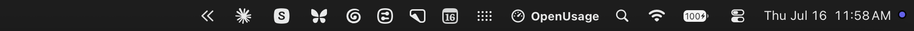

# 메뉴 막대

가장 중요한 지표에 별표를 달아 메뉴 막대 스트립에 바로 올리기.

## 아이콘 우클릭

메뉴 막대 아이콘을 우클릭(또는 Control-클릭)하면 **Settings**(설정)와 **Quit**(종료)가 담긴 빠른 메뉴가 열림.
좌클릭은 평소처럼 팝오버를 여는 동작.

## 별표 지정

지표에 별표를 달려면 각 행의 우클릭 메뉴, 또는 Customize에서 지표 옆에 항상 보이는 별표 버튼을 사용.

- 첫 실행 시 앱에는 기본 별표 세트(Antigravity Session/Weekly, Claude Weekly, Codex Weekly, Cursor Auto Usage/API Usage, Copilot Credits, Kimi Weekly, Kiro Credits, OpenRouter Credits, Z.ai Session/Weekly)가 들어 있어 스트립에 곧바로 숫자가 표시.
  언제든 변경 가능하며, 프로바이더의 Reset은 그 프로바이더의 기본값을, Reset All은 전체 세트를 복원.
  스트립에는 켜져 있는 프로바이더만 렌더링되고, 새로 설치한 앱은 Mac에서 감지된 프로바이더만 켜므로([대시보드 § 첫 실행](dashboard.md#첫-실행) 참조) 기본 별표가 쓰지 않는 도구로 메뉴 막대를 채우지 않음.
- 별표는 **프로바이더당 최대 2개**.
- 별표를 더 달 수 없을 때도 버튼은 그대로 클릭 가능 — 누르면 흔들리면서 Customize 하단에 이유가 임시 배지로 표시(예: "Up to 2 stars per provider"(프로바이더당 최대 2개)).
- Settings에서 관리형 Claude 또는 Codex 계정을 전환하면 그 프로바이더 패밀리의 기존 별표가 선택된 계정으로 한 번 이동.
  대시보드 헤더에서 계정을 고르는 것은 대시보드 보기만 바꾸며, 터미널 계정이나 메뉴 막대 별표는 그대로.

## 스타일

Settings → Appearance → Icon Style:

- **Text**(텍스트) — 프로바이더 아이콘과 값을 함께 표시하며, 같은 프로바이더의 별표 지표 두 개는 라벨이 붙은 쌍으로 쌓임.
- **Bars**(막대) — 한도가 있는 별표 지표 중 앞의 네 개를 담는 작은 기호(한도가 없는 지표는 Text 스타일에서만 표시).

## 화면 공유 중 사용량 숨기기

Settings → Privacy → **Hide From Screen Share**(화면 공유 중 숨기기, 기본값 켬).
화면이 공유되거나 녹화되는 동안 — Zoom/Meet/Teams 공유, 화면 녹화, macOS 화면 공유 — 스트립이 OpenUsage 아이콘과 워드마크로 대체되므로, 토큰 수와 지출이 다른 사람 앞에 드러나지 않음.
캡처가 끝나는 순간 별표 지표가 바로 복귀.
직접 시작한 캡처(예: 화면 녹화)도 해당되므로 그때도 워드마크가 표시.

감지는 시스템 자체의 "어떤 앱이 화면을 캡처 중" 신호를 사용 — 메뉴 막대의 캡처 표시기를 켜는 그 신호이며, 신호가 바뀌는 즉시 확인하고 설정이 켜져 있는 동안 몇 초마다 다시 확인.

평소:

화면이 공유되거나 녹화되는 동안:

## 스트립에 표시되는 내용

스트립은 실제 데이터만 렌더링.
아직 아무것도 가져오지 못한 별표 지표는 건너뛰고, 별표 지표가 전부 데이터 없는 프로바이더는 아이콘까지 통째로 사라짐.
아무 지표에도 데이터가 없으면 스트립은 앱 아이콘으로 대체.
별표는 Customize 순서를 따르며, 항상 표시 지표가 먼저, 그다음이 필요 시 표시 지표.
항상 표시든 필요 시 표시든 어느 쪽 지표에도 별표 지정 가능.
